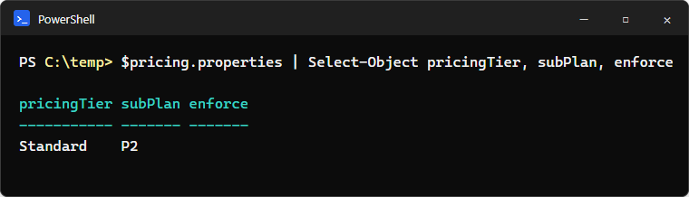
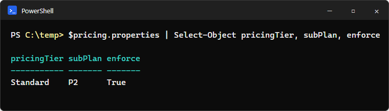
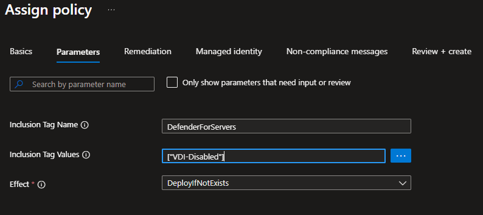
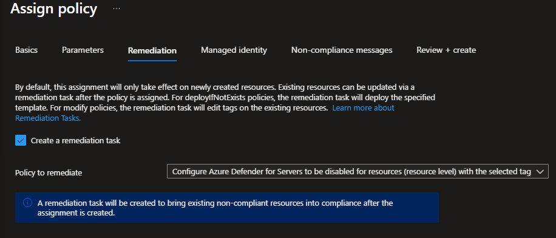
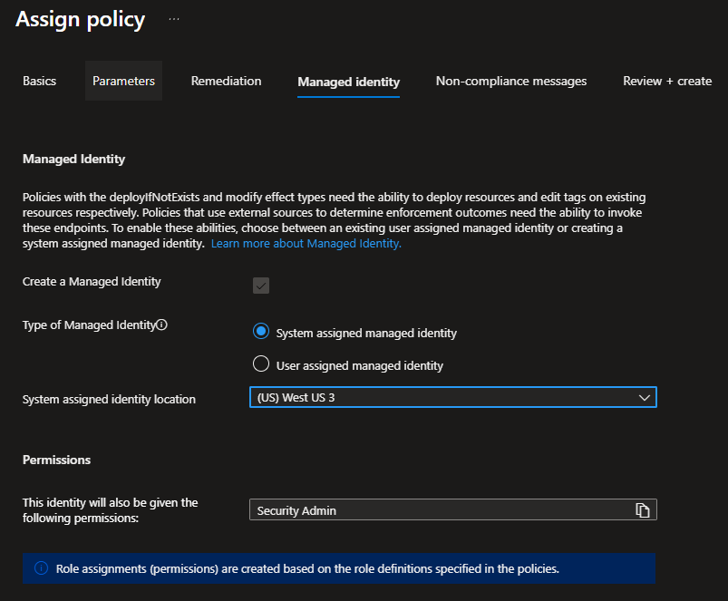

# Microsoft Defender for Servers: Resource-Level VDI Exclusions

## Table of Contents

- [Overview](#overview)
- [Before you begin](#before-you-begin)
- [Implementation walkthrough](#implementation-walkthrough)
- [Detailed implementation reference](#detailed-implementation-reference)
- [Troubleshooting](#troubleshooting)
- [Technical background and control model](#technical-background-and-control-model)
- [Backfill and audit](#backfill-and-audit)
- [Rollback](#rollback)

## Overview

This guide implements resource-level exclusions while retaining Defender for Servers Plan 2 as the subscription-wide default. A Microsoft built-in Azure Policy uses a resource tag to [disable Defender for Servers](https://learn.microsoft.com/en-us/azure/defender-for-cloud/tutorial-enable-servers-plan#disable-the-plan-using-azure-policy-for-resource-tag) on confirmed VDI resources by deploying `pricingTier: Free`. Untagged servers continue to inherit Plan 2. The guide covers the required subscription setting, policy assignment, remediation, validation, and rollback. Plan 1 is not used.

Use this Microsoft built-in policy:

> [**Configure Azure Defender for Servers to be disabled for resources (resource level) with the selected tag**](https://learn.microsoft.com/en-us/azure/governance/policy/samples/built-in-policies#security-center---granular-pricing)

| Property | Value |
| --- | --- |
| Policy definition ID | `080fedce-9d4a-4d07-abf0-9f036afbc9c8` |
| Effect | `DeployIfNotExists` |
| Target resources | Azure VMs, VM scale sets, and Azure Arc-enabled servers |
| Deployed configuration | `Microsoft.Security/pricings/VirtualMachines` |
| Pricing setting | `pricingTier: Free` |

## Before you begin

Confirm the following are available:

- The target subscription ID.
- A non-production pilot resource group.
- One representative VDI and one untagged control server in the pilot scope.
- **Owner**, or **Resource Policy Contributor** plus **User Access Administrator**, at the appropriate scope.
- Security-owner approval to change the Defender pricing `enforce` property if it is `True`.
- Confirmed separate Defender for Endpoint licensing, onboarding ownership, and EDR operations for excluded VDI resources.
- PowerShell 7.4 or later with the required Az modules if Microsoft's resource-level pricing script will be used.
- A named owner for VDI classification decisions, with an agreed approval and review process for the exclusion tag.

Record the resource IDs, current Defender for Endpoint state, and installed extensions for both pilot machines before making changes.

The resource-level exclusion is a standing security exception, with `DefenderForServers=VDI-Disabled` serving as its control signal. Manual tagging is acceptable for the pilot. Before production rollout, configure the VDI provisioning process or a narrowly scoped Azure Policy to apply the tag automatically to approved VDI hosts. Document who approves which host groups qualify, who owns the tagging configuration, and how the tagged resources are periodically reconciled against the approved VDI inventory. Azure Resource Graph can enumerate every resource carrying the tag for this reconciliation.

## Implementation walkthrough

Use this table as the implementation sequence. The [detailed implementation reference](#detailed-implementation-reference) below contains the portal steps and verification commands.

| Stage | Action | Continue when |
| --- | --- | --- |
| 1 | Read subscription pricing | The result is `Standard`, `P2`, and `enforce=False` or unset |
| 2 | Tag one pilot VDI | `DefenderForServers=VDI-Disabled` exists directly on the VM or VMSS |
| 3 | Assign the built-in policy | The assignment's managed identity has **Security Admin** at the assignment scope |
| 4 | Create remediation | Remediation completes successfully |
| 5 | Check the tagged VDI | Resource pricing is `Free` and `inherited=False` |
| 6 | Check the control server | The untagged server still inherits Plan 2 |
| 7 | Validate endpoint protection | The VDI is correctly licensed, onboarded, and reporting through the customer-owned Defender for Endpoint process |
| 8 | Test provisioning | A newly created VDI receives the tag automatically and reaches the excluded state |

For the pilot only, the tag can be applied manually to one representative VDI. Before production rollout, configure the VDI provisioning process to apply the tag automatically. If that process cannot apply Azure tags, use a narrowly scoped Azure Policy with a `Modify` effect instead.

Stop at any failed checkpoint. Do not continue to broader rollout until the current stage has been corrected and revalidated.

## Detailed implementation reference

Use a non-production resource group with one representative tagged VDI machine and one untagged control server. Capture each machine's resource-level pricing, Defender for Endpoint status, and installed extensions before making changes.

1. **Step 1A — Check subscription configuration (read-only).** Use [`Invoke-AzRestMethod`](https://learn.microsoft.com/en-us/powershell/module/az.accounts/invoke-azrestmethod) from Az PowerShell to record the subscription's current Defender for Servers tier, subplan, extensions, and `enforce` value. This `GET` request does not change the subscription.

    Specify the Microsoft Entra tenant ID and Azure subscription ID before signing in. Azure PowerShell can otherwise select a saved or default context, potentially from another tenant or subscription. This runbook targets Azure commercial and stops before making any Defender API request if the active context does not match the supplied values. For Azure Government, add `-Environment AzureUSGovernment` to `Connect-AzAccount`.

   ```powershell
   [guid]$tenantId       = '<tenant-id>'
   [guid]$subscriptionId = '<subscription-id>'

   Connect-AzAccount `
       -Tenant $tenantId `
       -Subscription $subscriptionId `
       -Scope Process `
       -ErrorAction Stop

   $context = Get-AzContext

   if (
       $null -eq $context -or
       $context.Tenant.Id -ne $tenantId.ToString() -or
       $context.Subscription.Id -ne $subscriptionId.ToString()
   ) {
       throw 'Azure connected to an unexpected tenant or subscription. Stop and verify the supplied values.'
   }

   "Connected: $($context.Account.Id) -> $($context.Subscription.Name) [$($context.Subscription.Id)]"

   $pricingPath = "/subscriptions/$subscriptionId/providers/Microsoft.Security/pricings/VirtualMachines?api-version=2024-01-01"
   $pricingResponse = Invoke-AzRestMethod -Method GET -Path $pricingPath
   if ($pricingResponse.StatusCode -ne 200) {
       throw "Unable to read subscription pricing. HTTP status: $($pricingResponse.StatusCode)"
   }
   $pricing = $pricingResponse.Content | ConvertFrom-Json
   $pricing.properties |
       Select-Object pricingTier, subPlan, enforce

   $pricing.properties.extensions |
       Select-Object name, isEnabled, additionalExtensionProperties,
           @{ Name = 'statusCode'; Expression = { $_.operationStatus.code } },
           @{ Name = 'statusMessage'; Expression = { $_.operationStatus.message } }
   ```

   If `enforce` is blank or `False`, no change is required; continue to Step 2. A blank value means `enforce` is unset and resource-level overrides are allowed.

   

   If `enforce` is `True`, continue to Step 1B after obtaining security-owner approval.

   

    In both cases, confirm that the displayed subscription name belongs to the customer and that the result shows `pricingTier: Standard` and `subPlan: P2`. If the subscription, tier, or subplan is not the expected value, stop before continuing.

   **Step 1B — Allow resource-level overrides (configuration change—approval required).** Run this block only when Step 1A reports exactly `pricingTier: Standard`, `subPlan: P2`, and `enforce: True`, and the security owner has approved the change. The guard below stops execution unless all three required values are present.

   > **Warning:** Do not run this command when `enforce` is already `False` or unset. If the subscription does not report `pricingTier: Standard` and `subPlan: P2`, stop and validate the customer's Defender configuration before continuing.

   ```powershell
   $currentContext = Get-AzContext
   if (
       $null -eq $currentContext -or
       $currentContext.Tenant.Id -ne $tenantId.ToString() -or
       $currentContext.Subscription.Id -ne $subscriptionId.ToString()
   ) {
       throw 'Azure context changed since Step 1A. Reconnect and re-run Step 1A before making any change.'
   }

   if (
       $pricing.properties.pricingTier -ne 'Standard' -or
       $pricing.properties.subPlan -ne 'P2' -or
       $pricing.properties.enforce -ne 'True'
   ) {
       throw 'Stop: expected pricingTier=Standard, subPlan=P2, and enforce=True. No change was made.'
   }

   $updateProperties = [ordered]@{
       pricingTier = $pricing.properties.pricingTier
       subPlan     = $pricing.properties.subPlan
       enforce     = 'False'
   }

   $cleanExtensions = @(
       foreach ($extension in $pricing.properties.extensions) {
           $cleanExtension = [ordered]@{
               name      = $extension.name
               isEnabled = $extension.isEnabled
           }

           if ($null -ne $extension.additionalExtensionProperties) {
               $cleanExtension['additionalExtensionProperties'] =
                   $extension.additionalExtensionProperties
           }

           $cleanExtension
       }
   )

   if ($cleanExtensions.Count -gt 0) {
       $updateProperties['extensions'] = $cleanExtensions
   }

   $payload = @{ properties = $updateProperties } | ConvertTo-Json -Depth 20
   $updateResponse = Invoke-AzRestMethod -Method PUT -Path $pricingPath -Payload $payload
   if ($updateResponse.StatusCode -notin 200, 201) {
       throw "Unable to update subscription pricing. HTTP status: $($updateResponse.StatusCode)"
   }
   ```

   Changing `enforce` to `False` does not disable Plan 2. It keeps Plan 2 as the subscription default while allowing explicit resource-level exceptions; untagged resources continue inheriting Plan 2. Run Step 1A again and verify `Standard`, `P2`, and `False`. A 200 or 201 response can include partial extension failures, so inspect each extension's `operationStatus` from the follow-up `GET` and confirm that all configured Plan 2 extensions remain in their intended state.

2. Open the representative VDI resource in the Azure portal, select **Tags**, and add this tag directly to the VM or VM scale set:

    | Azure tag field | Enter this value |
    | --- | --- |
    | **Name** | `DefenderForServers` |
    | **Value** | `VDI-Disabled` |

    Select **Apply** and confirm the tag appears on the resource. The notation `DefenderForServers=VDI-Disabled` is shorthand for the tag name and value. Do not enter the entire expression in either field. A tag applied only to the resource group does not satisfy this policy. Manual tagging is acceptable for this pilot. Before production rollout, configure the VDI provisioning process to apply the tag automatically, or use a narrowly scoped Azure Policy with a `Modify` effect if the provisioning process cannot apply Azure tags.
3. In **Policy** > **Definitions**, find and open policy definition `080fedce-9d4a-4d07-abf0-9f036afbc9c8`. Select **Assign policy**, select the target subscription as the **Scope**, and leave **Policy enforcement** set to **Default**, which enables enforcement. Do not select **Do not enforce**. This is separate from the Defender pricing `enforce` property, which must not be `True`. On the parameter page, clear **Only show parameters that need input or review** so all three policy parameters are visible.
4. Set **Inclusion Tag Name** to `DefenderForServers`, **Inclusion Tag Values** to `["VDI-Disabled"]`, and **Effect** to `DeployIfNotExists`. **Inclusion Tag Values** is an array parameter, so include the square brackets and quotation marks.

    

5. Select **Next** to open **Remediation**, then select **Create a remediation task**. Leave **Policy to remediate** set to the selected Defender for Servers policy. This creates a remediation task with the assignment so the existing tagged pilot resource is processed; without it, the assignment initially applies only when resources are created or updated. Remediation fails while the Defender pricing `enforce` property is `True`, because that setting prevents descendants from overriding the subscription pricing configuration. Resolve the prerequisite first rather than testing this condition in the customer subscription.

    

6. Select **Next** to open **Managed identity**. Confirm **Create a Managed Identity** is selected, select **System assigned managed identity**, and choose the **System assigned identity location**. The region stores the identity metadata and does not limit where the policy can remediate resources. The person creating the assignment needs **Resource Policy Contributor** plus **User Access Administrator**, or **Owner**, at the appropriate scope to create the assignment and grant its role. When the operator has **User Access Administrator** or **Owner**, the portal can create the required [**Security Admin**](https://learn.microsoft.com/en-us/azure/role-based-access-control/built-in-roles/security#security-admin) (`fb1c8493-542b-48eb-b624-b4c8fea62acd`) role assignment for the managed identity automatically. If it is not created, grant and verify it manually at the policy assignment scope before remediation. The [`DeployIfNotExists` effect](https://learn.microsoft.com/en-us/azure/governance/policy/concepts/effect-deploy-if-not-exists) performs remediation through this identity. Continue through **Non-compliance messages** to **Review + create**, then select **Create**.

    

7. **Verify the exclusion.** After selecting **Create** in step 6, wait for policy evaluation and background remediation. No additional action is required to start the remediation task selected in step 5.

    **Optional monitoring:** You can check **Policy** > **Remediation** > **Remediation tasks** for progress, but this is not required for validation. The task might not appear immediately while Azure evaluates the new assignment. An empty task list during this period does not mean the assignment failed, and you should not create a second remediation task.

    Run the following check once for the tagged VDI and again for the untagged control server. For each resource, copy the complete **Resource ID** from its **Properties** page in the Azure portal and paste it below.

   ```powershell
   $machineResourceId = '<paste-resource-id-here>'

   $resourcePricingPath = (
       "$machineResourceId/providers/Microsoft.Security/" +
       "pricings/VirtualMachines?api-version=2024-01-01"
   )

   $response = Invoke-AzRestMethod `
       -Method GET `
       -Path $resourcePricingPath

   if ($response.StatusCode -ne 200) {
       throw "Unable to read resource pricing. HTTP status: $($response.StatusCode)"
   }

   ($response.Content | ConvertFrom-Json).properties |
       Select-Object pricingTier, subPlan, inherited
   ```

   Compare each result with the expected values:

   | Resource checked | `pricingTier` | `subPlan` | `inherited` |
   | --- | --- | --- | --- |
   | Tagged VDI | `Free` | Blank | `False` |
   | Untagged control server | `Standard` | `P2` | `True` |

   These are Defender for Servers pricing properties, not resource tags. The tagged VDI result confirms that Defender for Servers is disabled at resource scope. The control result confirms that an untagged resource still inherits Plan 2 from the subscription. Review both machines in the Defender for Cloud [Coverage workbook](https://learn.microsoft.com/en-us/azure/defender-for-cloud/custom-dashboards-azure-workbooks) as the visual proof of coverage state.

   **Technical note:** A new assignment can take several minutes to begin evaluation, and remediation completion time depends on the scope and current service load. The pricing child resource is named `VirtualMachines` for all three supported resource types; only the parent provider segment in the copied Resource ID changes.

   | Resource type | Expected parent provider segment |
   | --- | --- |
   | Azure VM | `Microsoft.Compute/virtualMachines/<name>` |
   | VM scale set | `Microsoft.Compute/virtualMachineScaleSets/<name>` |
   | Azure Arc-enabled server | `Microsoft.HybridCompute/machines/<name>` |
8. Confirm endpoint protection remains healthy. Record which Defender for Endpoint and monitoring extensions remain installed, and verify the expected device state in the Microsoft Defender portal.
9. After configuring production tag automation, provision or replace a third VDI. Confirm the selected mechanism applies the tag and that the machine reaches compliance without manual tagging.
10. Remove the tag from a test VDI and confirm the `Free` resource-level object persists. Reapply the tag before completing the pilot.

Roll out one resource group at a time after security owners approve the pilot.

### Post-pilot billing confirmation

[Cost Management usage data is delayed](https://learn.microsoft.com/en-us/azure/cost-management-billing/costs/understand-cost-mgt-data), typically by 8-24 hours for Enterprise Agreement and Microsoft Customer Agreement subscriptions and up to 72 hours for pay-as-you-go subscriptions. The immediate evidence that the exclusion took effect is the resource-scope GET returning `pricingTier: Free` with `inherited: False`, together with the Coverage workbook.

Record billing confirmation as a scheduled follow-up. In Cost Management, filter Microsoft Defender for Cloud costs to the pilot scope. Where resource-level cost attribution is available, confirm the expected reduction or absence of Defender for Servers usage for the excluded pilot resource. Charges are prorated, so expect a partial-period reduction rather than an immediate drop to zero. Delayed or aggregated cost data should not by itself be treated as evidence that the exclusion failed.

| Owner | Due date | Result |
| --- | --- | --- |
| `<name>` | `<date>` | `Pending` |

## Troubleshooting

| Symptom | Cause | Action |
| --- | --- | --- |
| Remediation finds no resources, or the resource keeps inheriting Plan 2 | The tag is on the resource group. The policy matches tags applied directly to the resource; resource-group tags are not inherited. | Apply the tag directly to the VM or scale set, then re-evaluate. |
| The tag is applied, but compliance state and pricing are unchanged | Evaluation is not immediate. New or updated resources are typically reflected around 15 minutes later; standard reevaluation runs every 24 hours. | Trigger an on-demand compliance scan, then rerun the resource-scope GET. |
| Remediation fails and the resource still inherits Plan 2 | Subscription pricing `enforce` is `True`, which prevents descendants from overriding the subscription configuration. | Rerun the subscription GET; set `enforce` to `False` with security-owner approval. |
| The PUT returns 200, but a Plan 2 extension is not in its expected state | The API can update the pricing object while an individual extension reports failure. | Inspect the extension's `operationStatus.code` and `operationStatus.message`, correct the underlying failure, and rerun the GET. |

Add lab-observed failure modes only after recording the actual error text and validating the resolution.

## Technical background and control model

### Control model

Azure Policy and Microsoft's `ResourceLevelPricingAtScale.ps1` script both write the [`Microsoft.Security/pricings/virtualMachines` resource](https://learn.microsoft.com/en-us/rest/api/defenderforcloud-composite/pricings/update?view=rest-defenderforcloud-composite-stable) at VM, VMSS, or Arc server scope with API version `2024-01-01`. Microsoft calls this [**granular pricing** or **resource-level pricing**](https://learn.microsoft.com/en-us/azure/governance/policy/samples/built-in-policies#security-center---granular-pricing). Policy is the continuous control; the script supports one-time operations.

| Aspect | Built-in Azure Policy | `ResourceLevelPricingAtScale.ps1` |
| --- | --- | --- |
| Style | Declarative and continuous | Imperative and one-shot |
| Trigger | Policy evaluation and remediation | Manual execution |
| Selection | Direct resource tag configured in the definition | `TAG` or `RG` mode |
| Steady state | Self-heals and evaluates new or recreated VDI resources | Must be rerun for new resources |
| Use in this design | Deploy `pricingTier: Free` and remediate existing resources | Audit with `Read`; rollback with `Delete` |
| Rollback | Removing the tag or assignment does not delete deployed configuration | `Delete` removes the resource-level object |
| Requirements | Managed identity with Security Admin | PowerShell 7.4+, Az modules, and an operator with required pricing permissions such as Security Admin |

[At resource scope](https://learn.microsoft.com/en-us/azure/defender-for-cloud/plan-defender-for-servers-select-plan), Plan 1 or Plan 2 can be disabled, but only Plan 1 can be enabled. Plan 2 cannot be enabled there. The script's `Standard` option hardcodes `P1` and is not used. `Free` disables Defender for Servers; it is not a Plan 1 downgrade.

> **Note:** This runbook uses subscription-level Plan 2 with tagged resources set to Free. Azure also supports Plan 1 overrides for selected resources through a separate policy; those overrides likewise require the subscription pricing `enforce` property not to be `True`. Plan 2 cannot be enabled directly at resource level, and Plan 1 remains billable.

### Detailed prerequisites

#### Subscription pricing enforcement

The subscription-level `enforce` property controls whether descendant resources can override the subscription pricing configuration. `True` blocks resource-level exclusions; `False` or unset permits them. Follow Step 1A and Step 1B in the [detailed implementation reference](#detailed-implementation-reference) to inspect and, only with approval when required, update this setting.

#### Endpoint protection

Disabled VDI resources no longer receive the Defender for Servers entitlement. Do not rely on the [Defender for Endpoint integration in Defender for Cloud](https://learn.microsoft.com/en-us/azure/defender-for-cloud/integration-defender-for-endpoint) for their onboarding; establish and validate separate Defender for Endpoint licensing, onboarding, and EDR operations before rollout.

Setting `pricingTier: Free` does not uninstall `MDE.Windows`, `MDE.Linux`, Azure Monitor Agent, or Defender vulnerability management components already deployed to a machine. It also does not offboard a device already reporting to the Microsoft Defender portal. Consequently, a successfully excluded VDI can continue to appear protected in Defender for Endpoint. Define and test the intended endpoint state before rollout:

- Leave existing components installed and operate the device through the customer's separate Defender for Endpoint entitlement and management process; or
- Remove Defender for Cloud-managed components where appropriate, then onboard and manage the device using the customer's approved package and deployment method.

For non-persistent VDI, follow the [Defender for Endpoint VDI onboarding guidance](https://learn.microsoft.com/en-us/defender-endpoint/configure-endpoints-vdi), including the VDI onboarding package, golden-image preparation, and device identity behavior for session hosts.

#### Provisioning-time classification

The exclusion policy only acts after the authoritative tag exists directly on the VM or scale set. Resource-group tags are not inherited by this policy. Before production rollout, configure the VDI provisioning process to apply `DefenderForServers=VDI-Disabled` directly to every approved VM or VMSS resource when it is created or replaced. Validate that scale-out, rebuilds, image replacement, and alternate provisioning paths also apply the tag. If the provisioning process cannot apply Azure tags, assign a narrowly scoped companion Azure Policy with a [`Modify` effect](https://learn.microsoft.com/en-us/azure/governance/policy/concepts/effect-modify) instead. `Modify` applies the tag during resource creation or update; existing resources require a remediation task and a managed identity. Do not rely on a one-time manual tagging step for production.

#### Residual Defender CSPM coverage

If Defender CSPM is enabled at subscription scope, [agentless scanning for machines](https://learn.microsoft.com/en-us/azure/defender-for-cloud/concept-agentless-data-collection) can continue to assess an excluded VM. Document this residual coverage in the security and cost model; `pricingTier: Free` for Defender for Servers does not mean that every Defender for Cloud capability is disabled for that resource.

### Important conditions

1. Existing resources need an [Azure Policy remediation task](https://learn.microsoft.com/en-us/azure/governance/policy/how-to/remediate-resources). [New or updated resources are typically reflected around 15 minutes later](https://learn.microsoft.com/en-us/azure/governance/policy/how-to/get-compliance-data#evaluation-triggers); standard reevaluation runs every 24 hours, with no fixed completion time for large scopes. Use an on-demand scan when needed.
2. Check for management-group policies or automation that could overwrite the resource-level setting.
3. Removing the tag or assignment does not delete deployed configuration. Re-inheritance requires an explicit delete.
4. The 30-day Defender for Servers trial cannot be paused. Time the lab so its pricing observations represent the billing behavior intended for the demonstration.

## Backfill and audit

The policy remains authoritative. Use a policy remediation task to backfill confirmed existing VDI resources and leave the policy assigned for continuous evaluation. Use `ResourceLevelPricingAtScale.ps1` only for validation and rollback:

1. Run `Read` mode to audit the effective resource-level pricing objects after remediation.
2. Do not run the script in `Free` mode against policy-managed resources. Azure Policy and the script would become competing writers for the same resource-level pricing objects.
3. Do not use `Standard`; the script enables Plan 1 rather than restoring subscription-level Plan 2 inheritance.

## Rollback

Removing the tag or policy assignment does not delete a resource-level configuration already deployed by `DeployIfNotExists`.

1. Stop applying the classification tag to new resources, but retain it on existing excluded resources until their resource-level pricing objects have been deleted. Alternatively, export and preserve the complete affected-resource inventory before removing any tags.
2. Disable or delete the policy assignment.
3. Run `ResourceLevelPricingAtScale.ps1` in `Delete` mode, or issue the equivalent supported REST `DELETE`, to remove `Microsoft.Security/pricings/virtualMachines` from affected VDI resources.
4. Verify with the resource-scope GET that each resource again inherits subscription-level Plan 2.
5. Remove the classification tags from existing resources only after the `DELETE` operation and Plan 2 inheritance are verified.
6. Recheck endpoint state. Defender for Cloud can deploy its MDE extension when Plan 2 inheritance resumes, including to machines already onboarded separately through script, Group Policy, Intune, or a VDI onboarding package. Coordinate extension deployment and onboarding ownership before rollback to avoid conflicting management paths, then verify the installed extensions and device identity in the Microsoft Defender portal.
7. Confirm expected coverage in the Defender for Cloud Coverage workbook.

Microsoft provides the [`ResourceLevelPricingAtScale.ps1` management script](https://github.com/Azure/Microsoft-Defender-for-Cloud/tree/main/Powershell%20scripts/Defender%20for%20Servers%20on%20resource%20level) for these one-time operations.
